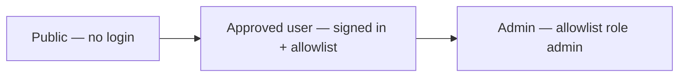
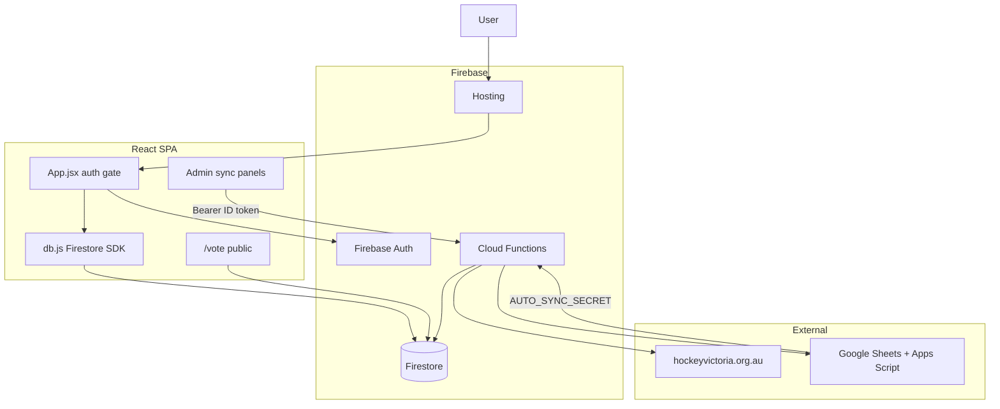

# MHC Squad Tracker — Documentation

Mentone Hockey Club squad planning app: round planner, availability, fixtures, player voting, and admin sync with Hockey Victoria (HV) and Google Sheets.

---

## Table of contents

- [Roadmap and ideas](#roadmap-and-ideas)
- [Part 1 — Using the app](#part-1--using-the-app)
  - [Access levels](#access-levels)
  - [Navigation](#navigation)
  - [Features](#features)
  - [Common workflows](#common-workflows)
  - [Access quick reference](#access-quick-reference)
- [Part 2 — Technical architecture](#part-2--technical-architecture)
  - [Overview](#overview)
  - [Stack and project layout](#stack-and-project-layout)
  - [Runtime diagram](#runtime-diagram)
  - [Authentication and authorization](#authentication-and-authorization)
  - [Firestore data model](#firestore-data-model)
  - [Cloud Functions](#cloud-functions)
  - [Deployment](#deployment)
- [Part 3 — HV sync and maintenance](#part-3--hv-sync-and-maintenance)
  - [In-app sync (Admin)](#in-app-sync-admin)
  - [CLI setup and scripts](#cli-setup-and-scripts)
  - [Match fields written by sync](#match-fields-written-by-sync)
  - [Season round notes](#season-round-notes)

---

## Roadmap and ideas

Use [`docs/ROADMAP.md`](./ROADMAP.md) as the consolidated list for planned work, backlog items, and ideas discussed in chat that are not yet implemented.

---

# Part 1 — Using the app

## Access levels

Every feature below is tagged with the minimum access required. There are three tiers:



| Tier | How you get it | What you can do |
|------|----------------|-----------------|
| **Public** | No account | Submit a 3-2-1 vote via a shared `/vote/...` link only |
| **Approved user** | Sign in with Google or email/password, and your email is on the allowlist with access enabled | Planner, Fixture, Availability; squad edits; create voting links; edit players and unavailability |
| **Admin** | Approved user **and** your allowlist entry has role `admin` (or you are the bootstrap admin email) | Everything above, plus Teams, Players, Votes, and Admin tabs; view vote ballots; run sync tools; manage users |

**Firestore vs UI:** In a few places the database enforces stricter rules than what the screen suggests. Those cases are called out with “rules enforce …”.

**Server admin list (HTTP sync):** Cloud Functions that scrape HV or read Google Sheets require a Firebase ID token for an email listed in `config/admins.emails`. That list is separate from the in-app `admin` role, though the same people are usually on both.

---

## Navigation

The app is a single-page app. Only the public vote page has its own URL.

| View | Nav label | Mobile |
|------|-----------|--------|
| Round planner | Planner | Bottom tab |
| Fixtures and digests | Fixture | Bottom tab |
| Unavailability grid | Availability | Bottom tab |
| Team ladders and squads | Teams | More menu — **Admin only** |
| Player directory | Players | More menu — **Admin only** |
| Voting dashboard | Votes | More menu — **Admin only** |
| Sync and user management | Admin | More menu — **Admin only** |

**Public URL (no login):** `/vote/:teamId/:roundKey` — e.g. share link for best-on-ground voting.

---

## Features

### Sign in and access

- **Google or email/password login** — Sign in to use the tracker. **(Approved)**
- **Access allowlist** — New users must be added in Admin → Users before they can use the app (bootstrap admin email always has access). **(Approved)**
- **“Access not approved”** — Shown when signed in but not on the allowlist; sign out and contact an admin. **(Approved gate)**
- **Sign out** — Confirms before logging out. **(Approved)**

### Planner

- **Squad selection** — Drag-and-drop players into team columns (PL, PLR, PB, PC, PE, Metro) for the selected round. **(Approved)**
- **Season and practice rounds** — Switch between competition rounds and practice sessions. **(Approved)**
- **Round management** — Create, copy, rename, delete rounds; advance to next season round; carry forward selections from a previous round. **(Approved)**
- **Player picker** — Search and filter when adding players to a team; open player detail from the picker. **(Approved)**
- **Kit clash warnings** — Highlights kit colour conflicts between teams. **(Approved)**
- **Unavailability overlay** — See who is marked unavailable for the current round (from Availability or sheet sync). **(Approved)**
- **Export team sheets** — Generate team sheet images for sharing. **(Approved)**
- **Export email digest** — Build HTML for a round email digest. **(Approved)**
- **Export player lists** — Copy plain-text player lists per team. **(Approved)**
- **Voting links** — Create or update a vote session and copy the public `/vote/...` link for a team and round. **(Approved)**
- **Vote results (overflow menu)** — View 3-2-1 tallies for the current round in the planner. **(Admin)**
- **Sync unavailability (toolbar)** — Pull availability from Google Sheets, review staged changes, confirm into Firestore (desktop only). **(Admin)**

### Availability

- **Round grid** — Mark players unavailable for Saturday and/or Sunday per round column. **(Approved)**
- **Bulk add** — Search and add multiple players to a round column at once. **(Approved)**
- **Live sync to Planner** — Changes update in real time for anyone viewing the planner. **(Approved)**

### Fixture

- **Match cards** — Browse season rounds; see opponent, venue, time, result, score, cards, and scorers per team. **(Approved)**
- **Copy all fixtures** — Copy a text summary of fixtures for the selected round. **(Approved)**
- **Weekly digest** — Browse digests generated by HV sync; copy HTML or text; export triptych images. **(Approved)** — digest content is produced by **(Admin)** HV sync

### Teams

- **Ladder and record** — Competition ladder position and W/D/L per team. **(Admin)** — entire Teams tab
- **Squad roster** — Players on the team with 2026 stats (games, goals, card points). **(Admin)**
- **HV links** — Open team pages on hockeyvictoria.org.au. **(Admin)**
- **Votes tab** — Per-team vote tallies and response detail by round. **(Admin)**
- **HV name aliases** — Resolve player names that did not match after HV stats sync. **(Admin)**

### Players

- **Player directory** — Searchable, sortable list with status filters and stats columns. **(Admin)** — nav tab
- **Add player** — Create a new roster entry. **(Admin)**
- **Player detail modal** — Edit profile, survey fields, 2026 season data, 2025 history, notes, and per-round unavailability. **(Admin)** from Players tab; also opened from Planner and Availability **(Approved)** for editing in those flows

### Votes (overview)

- **Cross-team dashboard** — Participation, open sessions, copy links, close or reopen sessions, season tally, sparklines. **(Admin)**
- **Read individual ballots** — View who voted for whom. **(Admin)** — rules enforce: anyone can **create** a ballot on the public page; only admins can **read** responses in Firestore

### Public voting

- **Vote page** — Open shared link; assign 3, 2, and 1 points to three different players; submit once per session. **(Public)**

### Admin hub

- **HV Sync** — Scrape HV for results, fixtures, and player stats; run ladder sync; generate weekly digest; resolve unmatched HV names; master sync (ladder + HV + stats). **(Admin)** — HTTP calls also require server admin email in `config/admins`
- **Availability sync** — Resolve names from the sheet that did not match roster players; run manual full sync; maintain ignore list. **(Admin)** — orange badge on Admin nav when unmatched names are queued
- **Users** — Add or remove emails, enable or disable access, set role to `user` or `admin`. **(Admin)**

---

## Common workflows

### Weekly squad planning (Approved)

1. Open **Planner** and select the season round (or a practice round).
2. Assign players to team columns via drag-and-drop or the picker.
3. Check unavailability overlays (updated from **Availability** or sheet sync).
4. Export team sheets, email digest, or player lists as needed.
5. Optionally create **voting links** and share with the squad.

### Marking availability (Approved)

1. Open **Availability** and select a round column.
2. Toggle Saturday/Sunday for players, or bulk-add via search.
3. Changes appear live in **Planner** for all users.

### Viewing fixtures and digests (Approved)

1. Open **Fixture** and browse rounds.
2. Review match results, cards, and scorers.
3. Open **Weekly digest** in the sidebar to copy or export content (after an admin has run HV sync).

### Player voting (Public + Approved + Admin)

1. **Approved:** In Planner overflow → **Voting links**, create a session and copy the `/vote/...` URL.
2. **Public:** Players open the link (no login) and submit 3-2-1 points.
3. **Admin:** View results in Planner overflow, **Votes** overview, or **Teams → Votes**; close or reopen sessions as needed.

### Roster, stats, and sync (Admin)

1. **Players:** Maintain the roster; open profiles for full edits.
2. **Teams:** Check ladders, squad stats, resolve HV name aliases.
3. **Admin → HV Sync:** Run sync after weekend games; review digest and unmatched names.
4. **Admin → Availability:** Resolve sheet name mismatches when the badge appears.
5. **Admin → Users:** Grant access and promote selectors to `admin` if needed.

---

## Access quick reference

| Feature | Public | Approved | Admin |
|---------|:------:|:--------:|:-----:|
| Vote via `/vote/...` link | Yes | — | — |
| Sign in and use Planner | — | Yes | Yes |
| Fixture and Availability | — | Yes | Yes |
| Create voting links | — | Yes | Yes |
| Edit rounds, selections, players, unavailability | — | Yes | Yes |
| Export team sheets / digest / lists | — | Yes | Yes |
| Teams, Players, Votes, Admin nav | — | — | Yes |
| View vote results / read ballots | — | — | Yes |
| Planner: vote results menu, sheet sync button | — | — | Yes |
| HV sync, availability admin, user management | — | — | Yes |
| Allowlist CRUD (`allowedUsers`) | — | — | Yes (rules) |

---

# Part 2 — Technical architecture

## Overview

**MHC Squad Tracker** is a React single-page application deployed on Firebase Hosting. Firestore is the primary database; the browser performs most reads and writes via the Firebase JS SDK. Python Cloud Functions handle web scraping (Hockey Victoria), Google Sheets availability import, and privileged batch updates that should not run on the client.

There is no separate backend API layer for normal app operations.

## Stack and project layout

| Layer | Technology |
|-------|------------|
| UI | React 19, React Router 7, Tailwind CSS 4, Vite 8, lucide-react |
| Client data | Firebase JS SDK 12 (Auth + Firestore) |
| Backend | Firebase Cloud Functions (Python 3.12) |
| Scraping | `requests`, BeautifulSoup4 |
| Export | html2canvas (team sheets, digest images) |
| Hosting | Firebase Hosting (SPA rewrite to `index.html`) |

```
hockey-2026/
├── src/                    # React app
│   ├── main.jsx            # Router: /vote/* public, App catch-all
│   ├── App.jsx             # Auth gate, navigation, views
│   ├── auth.js             # Firebase Auth helpers
│   ├── access.js           # Bootstrap admin + isAdminUser
│   ├── firebase.js         # SDK init (VITE_* env vars)
│   ├── db.js               # Players, rounds, matches, unavailability, digests
│   ├── db.access.js        # allowedUsers
│   ├── db.votes.js         # Vote sessions and responses
│   └── components/         # Views + admin panels
├── functions/main.py       # All Cloud Functions
├── firestore.rules
├── firebase.json
└── scripts/                # CLI sync, seed, and archived one-off tools (see scripts/README.md)
```

## Runtime diagram



**Typical weekly flow**

1. Admin runs HV sync → match scores and `weeklyDigests` updated.
2. Selectors use Planner → `rounds/{id}/selections` written from the client.
3. Availability from sheet (auto or manual confirm) → `playerUnavailability`.
4. All users read Fixture + digests; vote links point to the public vote page.

## Authentication and authorization

**Client flow**

1. User signs in on `LoginPage` (Google popup or email/password).
2. `App.jsx` waits for auth, then loads `allowedUsers/{email}` unless bootstrap admin.
3. `isAdminUser()` is true for bootstrap admin email or `allowedUsers.role === 'admin'`.
4. Nav items with `adminOnly: true` are hidden for non-admins.

**Bootstrap admin:** Hardcoded in `src/access.js` and mirrored in `firestore.rules` (same email as `isBootstrapAdmin()`).

**Firestore rules (summary)**

| Helper | Meaning |
|--------|---------|
| `isApprovedTrackerUser()` | Signed in + allowlist enabled (or bootstrap admin) |
| `isTrackerAdmin()` | Approved + `role == 'admin'` (or bootstrap admin) |

Notable rules:

- `rounds` — public **read** (vote URLs resolve round keys); writes require approved user.
- `votes/{id}` — public **get**; list/create/update require approved user.
- `votes/{id}/responses` — public **create**; read/update/delete require tracker admin.
- `allowedUsers` — user can read own doc; only tracker admin can list or manage.

**Cloud Functions:** `require_admin()` verifies Bearer Firebase ID token and checks email against `config/admins.emails`.

**Public route:** `/vote/:teamId/:roundKey` → `VotingPage.jsx` (no auth).

## Firestore data model

| Collection / path | Purpose |
|-----------------|---------|
| `config/*` | Teams, statuses, admins, HV/name aliases, unavailability ignore lists |
| `players` | Roster, stats, assignments |
| `rounds/{id}` | Season round metadata |
| `rounds/{id}/matches` | Fixtures, scores, HV sync fields, kit colours |
| `rounds/{id}/selections` | Per-team squad picks for a round |
| `playerUnavailability` | Per-player round availability |
| `hvSync/latest`, `hvSync/ladders` | Last sync snapshot and ladder data |
| `weeklyDigests/round_N` | Saved HTML/text digests |
| `votes/{sessionId}` | Vote session metadata (`{roundId}__{teamId}`) |
| `votes/{sessionId}/responses` | Anonymous ballot rows |
| `allowedUsers/{email}` | `enabled`, `role` (`user` \| `admin`) |
| `unavailabilitySyncs/{roundId}` | Written by functions during sheet sync (not used by client rules for direct access) |

**Shared UAT Firestore:** Rules also cover `teams`, `fixtures`, `competitions`, `ladders`, `clubOverrides`, `syncState` for the separate **mentone-fixture** app (public read, no client writes from this app). Keep `firestore.rules` in sync with that repo before deploying to UAT.

## Cloud Functions

Region: `australia-southeast1`. Source: `functions/main.py`.

| Function | Auth | Purpose |
|----------|------|---------|
| `syncHv` | ID token + `config/admins` | Scrape HV; update matches; build digest → `hvSync/latest`, `weeklyDigests/round_N` |
| `syncLadder` | Same | Ladder scrape → `hvSync/ladders` |
| `syncPlayerStats` | Same | Per-game stats → player `stats2026` |
| `syncUnavailability` | Same | Read Google Sheet → staged JSON (no writes) |
| `confirmUnavailabilitySync` | Same | Write confirmed rows → `playerUnavailability` |
| `autoSyncUnavailability` | `AUTO_SYNC_SECRET` | Apps Script trigger → Firestore + unmatched queue |

The Admin UI calls these via `VITE_SYNC_*` and `VITE_CONFIRM_*` URLs in `.env.uat` / `.env.production`.

## Deployment

| Environment | Firebase project | Build | Deploy |
|-------------|------------------|-------|--------|
| UAT | `hockey-2026-uat` | `npm run build:uat` | `npm run deploy:uat` |
| Production | `hockey-2026-f521f` | `npm run build` | `npm run deploy:prod` |

- Hosting serves `dist/` with SPA rewrite to `/index.html`.
- Functions: `firebase deploy --only functions`
- Rules: `firebase deploy --only firestore:rules`
- Local dev: `npm run dev` (Vite, port 5173)

---

# Part 3 — HV sync and maintenance

## In-app sync (Admin)

The primary way to sync HV data is **Admin → HV Sync** in the app (requires Admin role and a server-admin email for HTTP endpoints):

- **Sync HV** — Results, fixtures, scorers for recent rounds; updates `weeklyDigests`.
- **Sync ladder** — Competition ladder positions.
- **Sync player stats** — Aggregates into player documents.
- **Master sync** — Ladder + HV + player stats in one run.
- **Resolve unmatched names** — Map HV player names to roster players after sync.

Unavailability from Google Sheets can also be triggered from **Planner** (sync button) or **Admin → Availability** (resolve mismatches, manual sync).

## CLI setup and scripts

Use CLI scripts for local runs, dry runs, or when not using the Admin UI. Both default to `--env uat` so production is not updated by accident.

### Service account keys

| Env | Project ID | Key file |
|-----|------------|----------|
| Prod | `hockey-2026-f521f` | `hockey-2026-f521f-firebase-adminsdk-fbsvc-6c421c359a.json` |
| UAT | `hockey-2026-uat` | `hockey-2026-uat-firebase-adminsdk.json` |

**To get the UAT key:**

1. Firebase Console → select `hockey-2026-uat`
2. Project Settings → Service accounts → Generate new private key
3. Save as `hockey-2026-uat-firebase-adminsdk.json` in the project root

Never commit key files to git.

### Install dependencies (one-time)

```bash
pip install firebase-admin openpyxl requests beautifulsoup4
```

### Step 1 — Seed fixtures from Excel (season start)

```bash
# Preview first (no writes) — reads scripts/data/fixture_2026.json
python scripts/seed_fixtures.py --dry-run

# Write to UAT (default)
python scripts/seed_fixtures.py

# Write to PROD only once UAT looks good
python scripts/seed_fixtures.py --env prod
```

### Step 2 — Weekly HV sync (Tuesday or Wednesday after games)

Scrapes HV for the most recent round, writes scores and scorers to Firestore, and prints a digest for email or WhatsApp.

```bash
# All 6 comps → UAT (default)
python scripts/sync_hv.py

# Digest only, no Firestore write
python scripts/sync_hv.py --no-firebase

# Dry run
python scripts/sync_hv.py --dry-run

# Production
python scripts/sync_hv.py --env prod

# Single competition
python scripts/sync_hv.py --comp MPL
```

See [`scripts/README.md`](../scripts/README.md) for ladder sync, archived one-off scripts, and Apps Script setup.

## Match fields written by sync

Fields on `rounds/{id}/matches/{teamId}`:

| Field | Type | Source | Notes |
|-------|------|--------|-------|
| matchDate | string | Excel / HV | YYYY-MM-DD |
| time | string | Excel / HV | HH:MM |
| venue | string | Excel / HV | Full venue name |
| opponent | string | Excel / HV | Opponent club name |
| scoreFor | int | HV | Mentone goals |
| scoreAgainst | int | HV | Opponent goals |
| result | string | HV | Win / Loss / Draw |
| scorers | string[] | HV | e.g. `['First Last', 'Name (2)']` |
| hvGameUrl | string | HV | Link to HV game page |
| hvLastSync | string | sync | ISO timestamp of last sync |

Existing planner fields (`topColour`, `socksColour`, `arriveAt`) are never overwritten by sync.

## Season round notes

- **Rounds 1–18:** All six competitions play (regular season weekends).
- **Rounds 19–22:** MPL only (midweek rounds at Parkville). The seed script applies this automatically.
